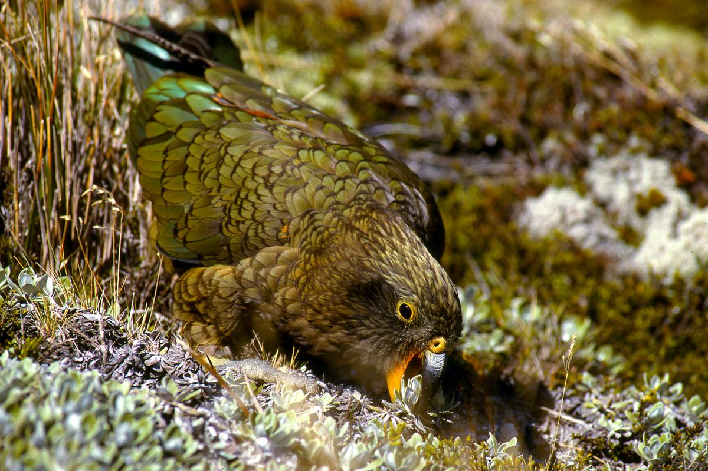
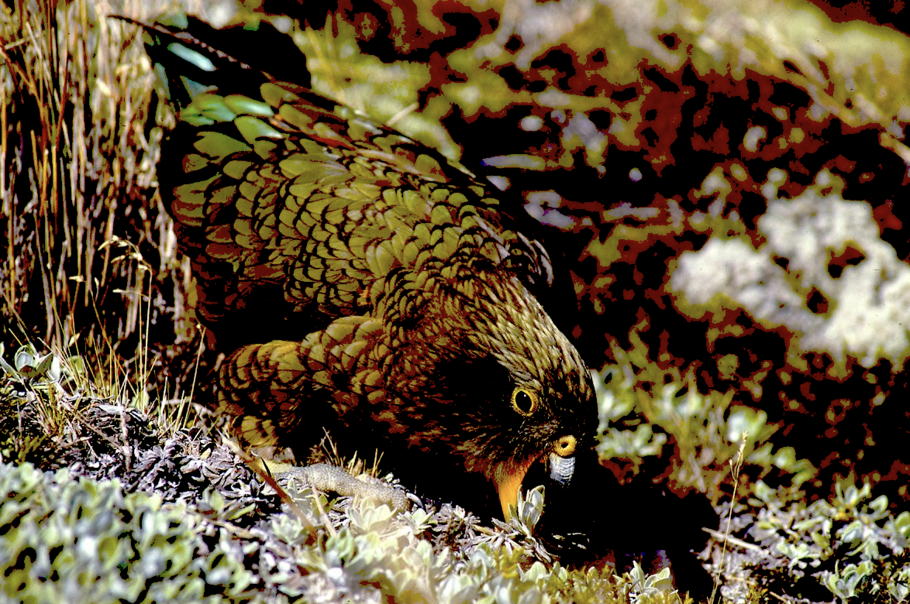

## 1. Lossy compression demo
See how image compression works!

Original image: 
Compressed image example: 
Red channel reduction: 66%   
Green channel reduction: 53%   
Blue channel reduction: 30%    

### Prerequisites
- Python 3.13
- PIL (Pillow) for image processing: `uv pip install Pillow` if you don't have it installed.

### Getting started

1. Clone this repository and cd into it
2. Run `python3 lossy_compression.py`

## 2. Steganography demo

(not tested)

### Prerequisites
- Python 3.13
- cv2, numpy, matplotlib. 
You can just install them using `uv pip install cv2 numpy matplotlib`.

### Getting started
1. In a new terminal, run `python3 steganography.ipynb`

### Process
1. Convert hidden message into ascii representations and then into binary 
2. In each channel, each pixel is stored in a single byte, which is 8 bits. This provides us with 8 bit planes of varying significance
To be discreet, we extract the least significant bit plane values.
3. Mix our message in binary representation into the lowest bit plane
4. Add the decoded bit plane back to the original image
5. To verify, we could retrieve the message from the image